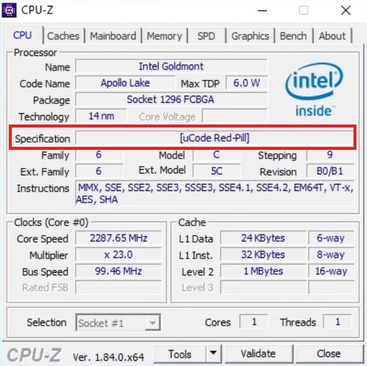

# **Disclaimer**

**All information is provided for educational purposes only. Follow these instructions at your own risk. Neither the authors nor their employer are responsible for any direct or consequential damage or loss arising from any person or organization acting or failing to act on the basis of information contained in this page.**

# Description
IPC scripts allowing to extract and modify [Intel Microcode](https://en.wikipedia.org/wiki/Intel_Microcode) (msrom) from your own Atom Goldmont platform.

# Research Team

Mark Ermolov ([@\_markel___][1])

Maxim Goryachy ([@h0t_max][2])

Dmitry Sklyarov ([@_Dmit][3])

[1]: https://twitter.com/_markel___
[2]: https://twitter.com/h0t_max
[3]: https://twitter.com/_Dmit
